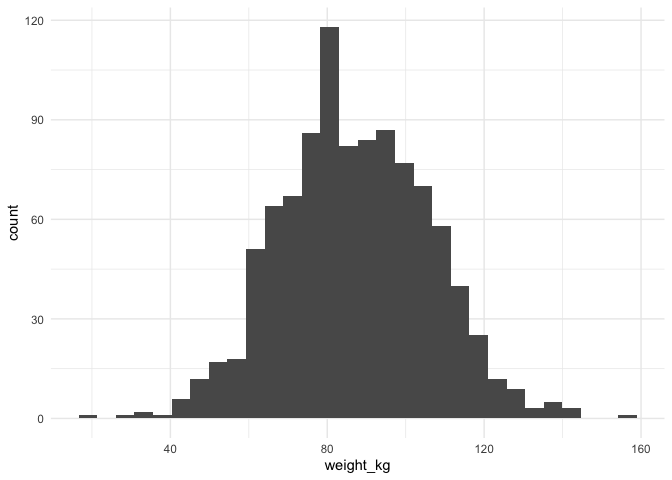
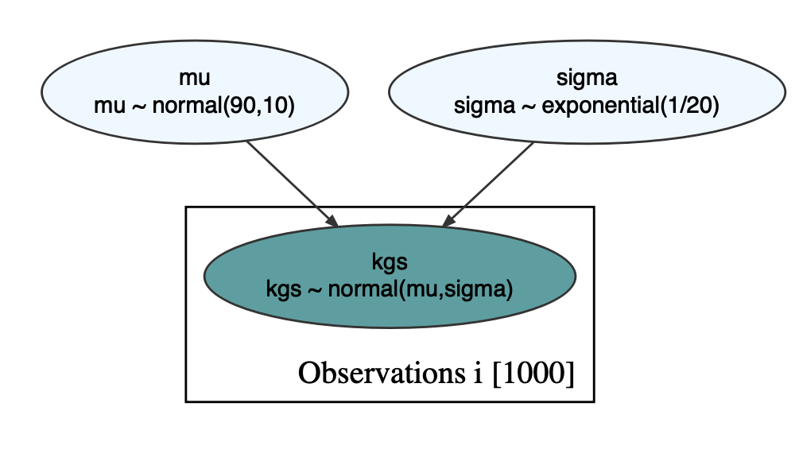
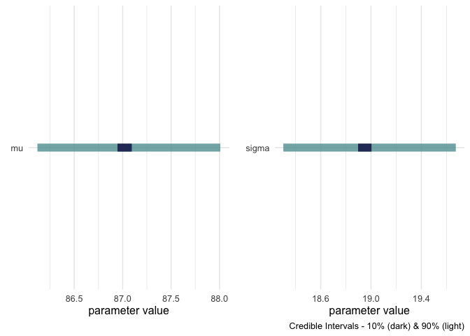
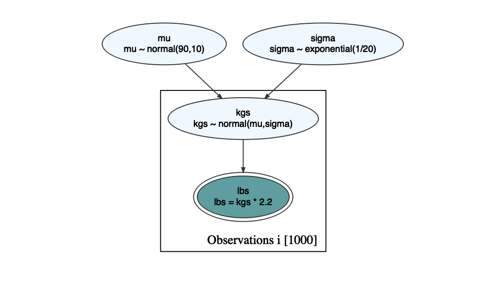
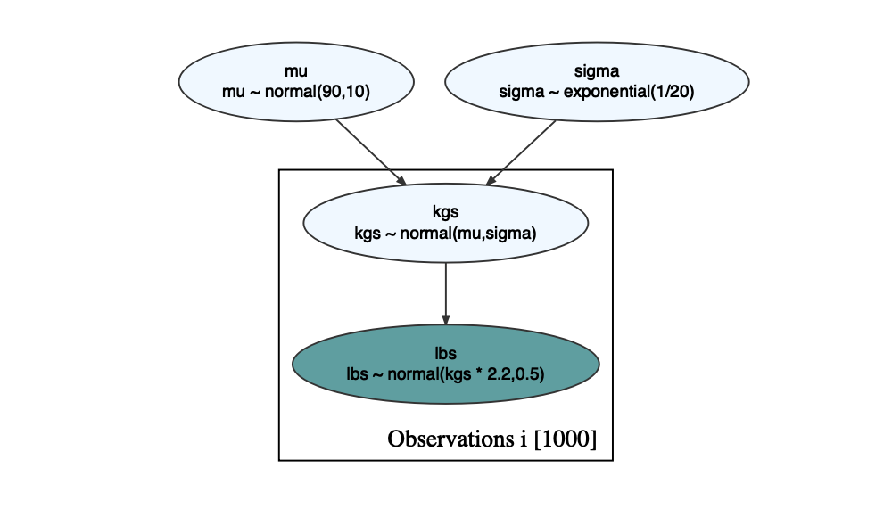
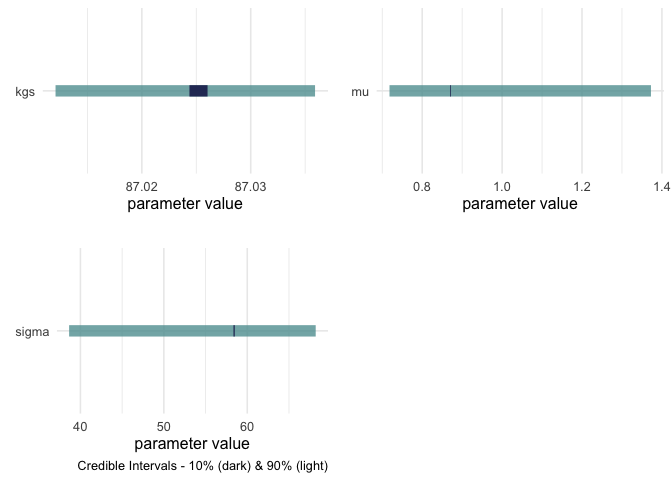

Greta and Causact: A Question
================
Peter Rabinovitch
2022-12-03 10:57:35

# Introduction

About a year ago I wrote a
[post](https://prabinov42.github.io/posts/greta_and_causact/) abut using
the *causact* R library, which uses the *greta* library, which uses
*TensorFlow* to estimate Bayesian models.

One thing I ran into was that the last line of greta code seemed to
always have to be the observation model, like distribution(outcomes) \<-
normal(mu, sd). But what if what I actually have is some (deterministic)
transformation as my outputs?

For example, say I’ve got weight measurements in imperial (pounds), but
my probabilistic model and everything else is in metric (kilograms).
Shouldn’t there be an easy way to encode this? It didn’t seem there
was - but I thought of a hack. Just have the probabilistic model feed
into another distribution with the mean being the output of the
probabilistic model, and a very small variance. The question was, would
that work? And would it work in more complex situations where rather
than just a unit change, the deterministic part was a more complicated
function, like a power?

# An Example

Hopefully the following examples will clarify and illustrate the
problem.

``` r
library(tidyverse)
library(knitr)
library(bayesplot)
library(greta)
library(causact)
```

I have a sample of weights of adult male humans, in both kg & lbs.

``` r
set.seed(2022)
n<-1000
weight_kg <- rnorm(n,87, 19) # kg
df <- tibble(weight_kg = weight_kg, weight_lbs = weight_kg*2.2 )
df %>% ggplot(aes( x = weight_kg))+geom_histogram()+theme_minimal()
```

    ## `stat_bin()` using `bins = 30`. Pick better value with `binwidth`.

<!-- -->

``` r
df %>% ggplot(aes( x = weight_lbs))+geom_histogram()+theme_minimal()
```

    ## `stat_bin()` using `bins = 30`. Pick better value with `binwidth`.

<!-- -->

I can do a simple causact model for the weight in kg like so:

``` r
graph <- dag_create() %>%
  dag_node("kgs", "kgs", rhs = normal(mu, sigma), data = df$weight_kg) %>%
  dag_node("mu", "mu", rhs = normal(90, 10), child = "kgs") %>%
  dag_node("sigma", "sigma", rhs = exponential(1/20), child = "kgs") %>%  
  dag_plate("Observations", "i", nodeLabels = c("kgs")) 
graph %>% dag_render()
```

<!-- -->

``` r
set.seed(2022)
drawsDF <- graph %>% dag_greta(mcmc=TRUE)
```

    ## ℹ Initialising python and checking dependencies, this may take a moment.

    ## ✔ Initialising python and checking dependencies ... done!

    ## 

    ## running 4 chains simultaneously on up to 12 cores

    ## 

    ##     warmup                                           0/1000 | eta:  ?s              warmup ==                                       50/1000 | eta: 19s | 30% bad    warmup ====                                    100/1000 | eta: 14s | 16% bad    warmup ======                                  150/1000 | eta: 11s | 11% bad    warmup ========                                200/1000 | eta: 10s | 8% bad     warmup ==========                              250/1000 | eta:  9s | 6% bad     warmup ===========                             300/1000 | eta:  8s | 5% bad     warmup =============                           350/1000 | eta:  7s | 5% bad     warmup ===============                         400/1000 | eta:  7s | 4% bad     warmup =================                       450/1000 | eta:  6s | 4% bad     warmup ===================                     500/1000 | eta:  6s | 3% bad     warmup =====================                   550/1000 | eta:  5s | 3% bad     warmup =======================                 600/1000 | eta:  4s | 3% bad     warmup =========================               650/1000 | eta:  4s | 2% bad     warmup ===========================             700/1000 | eta:  3s | 2% bad     warmup ============================            750/1000 | eta:  3s | 2% bad     warmup ==============================          800/1000 | eta:  2s | 2% bad     warmup ================================        850/1000 | eta:  2s | 2% bad     warmup ==================================      900/1000 | eta:  1s | 2% bad     warmup ====================================    950/1000 | eta:  1s | 2% bad     warmup ====================================== 1000/1000 | eta:  0s | 2% bad 
    ##   sampling                                           0/1000 | eta:  ?s            sampling ==                                       50/1000 | eta:  7s            sampling ====                                    100/1000 | eta:  6s            sampling ======                                  150/1000 | eta:  5s            sampling ========                                200/1000 | eta:  6s            sampling ==========                              250/1000 | eta:  5s            sampling ===========                             300/1000 | eta:  5s            sampling =============                           350/1000 | eta:  5s            sampling ===============                         400/1000 | eta:  4s            sampling =================                       450/1000 | eta:  4s            sampling ===================                     500/1000 | eta:  4s            sampling =====================                   550/1000 | eta:  4s            sampling =======================                 600/1000 | eta:  3s            sampling =========================               650/1000 | eta:  3s            sampling ===========================             700/1000 | eta:  2s            sampling ============================            750/1000 | eta:  2s            sampling ==============================          800/1000 | eta:  2s            sampling ================================        850/1000 | eta:  1s            sampling ==================================      900/1000 | eta:  1s            sampling ====================================    950/1000 | eta:  0s            sampling ====================================== 1000/1000 | eta:  0s

``` r
drawsDF %>% dagp_plot()
```

<!-- -->

Perfect!

But what if our output (i.e. the data) was in lbs, not kg?  
I can try a simple extension…

``` r
graph <- dag_create() %>%
  dag_node("lbs", "lbs", rhs = kgs*2.2, data = df$weight_kg) %>%  
  dag_node("kgs", "kgs", rhs = normal(mu, sigma), child='lbs') %>%
  dag_node("mu", "mu", rhs = normal(90, 10), child = "kgs") %>%
  dag_node("sigma", "sigma", rhs = exponential(1/20), child = "kgs") %>%  
  dag_plate("Observations", "i", nodeLabels = c("kgs", "lbs")) 
graph %>% dag_render()
```

<!-- -->

``` r
set.seed(2022)
```

The diagram looks like we want, but greta complains.

``` r
drawsDF <- graph %>% dag_greta(mcmc=TRUE)
```

We get “Error: distributions can only be assigned to data
<greta array>s”

Ok, so what about a simple hack? What if we make the output node
probabilistic, with small variance?

``` r
graph <- dag_create() %>%
  dag_node("lbs", "lbs", rhs = normal(kgs*2.2, 0.5), data = df$weight_lbs) %>%  
  dag_node("kgs", "kgs", rhs = normal(mu, sigma), child='lbs') %>%
  dag_node("mu", "mu", rhs = normal(90, 10), child = "kgs") %>%
  dag_node("sigma", "sigma", rhs = exponential(1/20), child = "kgs") %>%  
  dag_plate("Observations", "i", nodeLabels = c("kgs", "lbs")) 
graph %>% dag_render()
```

<!-- -->

``` r
set.seed(2022)
drawsDF <- graph %>% dag_greta(mcmc=TRUE)
```

    ## running 4 chains simultaneously on up to 12 cores

    ## 

    ##     warmup                                           0/1000 | eta:  ?s              warmup ==                                       50/1000 | eta: 20s | 18% bad    warmup ====                                    100/1000 | eta: 14s | 9% bad     warmup ======                                  150/1000 | eta: 12s | 14% bad    warmup ========                                200/1000 | eta: 10s | 15% bad    warmup ==========                              250/1000 | eta:  9s | 16% bad    warmup ===========                             300/1000 | eta:  8s | 18% bad    warmup =============                           350/1000 | eta:  8s | 20% bad    warmup ===============                         400/1000 | eta:  7s | 22% bad    warmup =================                       450/1000 | eta:  6s | 19% bad    warmup ===================                     500/1000 | eta:  6s | 17% bad    warmup =====================                   550/1000 | eta:  5s | 16% bad    warmup =======================                 600/1000 | eta:  4s | 14% bad    warmup =========================               650/1000 | eta:  4s | 13% bad    warmup ===========================             700/1000 | eta:  3s | 12% bad    warmup ============================            750/1000 | eta:  3s | 12% bad    warmup ==============================          800/1000 | eta:  2s | 11% bad    warmup ================================        850/1000 | eta:  2s | 10% bad    warmup ==================================      900/1000 | eta:  1s | 10% bad    warmup ====================================    950/1000 | eta:  1s | 9% bad     warmup ====================================== 1000/1000 | eta:  0s | 9% bad 
    ##   sampling                                           0/1000 | eta:  ?s            sampling ==                                       50/1000 | eta:  7s            sampling ====                                    100/1000 | eta:  6s            sampling ======                                  150/1000 | eta:  6s            sampling ========                                200/1000 | eta:  5s            sampling ==========                              250/1000 | eta:  5s            sampling ===========                             300/1000 | eta:  5s            sampling =============                           350/1000 | eta:  5s            sampling ===============                         400/1000 | eta:  4s            sampling =================                       450/1000 | eta:  4s            sampling ===================                     500/1000 | eta:  4s            sampling =====================                   550/1000 | eta:  3s            sampling =======================                 600/1000 | eta:  3s            sampling =========================               650/1000 | eta:  3s            sampling ===========================             700/1000 | eta:  2s            sampling ============================            750/1000 | eta:  2s            sampling ==============================          800/1000 | eta:  2s            sampling ================================        850/1000 | eta:  1s            sampling ==================================      900/1000 | eta:  1s            sampling ====================================    950/1000 | eta:  0s            sampling ====================================== 1000/1000 | eta:  0s

``` r
drawsDF %>% dagp_plot()
```

<!-- -->

Again, the diagram looks ok, and greta does not complain now.

But the results are puzzling. I get estimates of kgs (about 87), mu
(about 0.85), and sigma (about 58). I’m not sure what these are supposed
to mean. I would have expected the estimate of mu to be about 87, and
sigma about 19.

# Conclusion

Am I misunderstanding something, or is it simply that greta can not
handle this kind of problem? Note that this is just a simple case of
what I am really after, which is that the output could be some arbitrary
function of the node before it (eg, if we had, rather than kg, we had
lbs^2 or something like that).

# Appendices

<details>
<summary>

References

</summary>

[greta](https://greta-stats.org/index.html)  
[causact](https://www.causact.com/)

</details>
<details>
<summary>

SessionInfo

</summary>

``` r
sessionInfo()
```

    ## R version 4.1.2 (2021-11-01)
    ## Platform: x86_64-apple-darwin17.0 (64-bit)
    ## Running under: macOS Big Sur 10.16
    ## 
    ## Matrix products: default
    ## BLAS:   /Library/Frameworks/R.framework/Versions/4.1/Resources/lib/libRblas.0.dylib
    ## LAPACK: /Library/Frameworks/R.framework/Versions/4.1/Resources/lib/libRlapack.dylib
    ## 
    ## locale:
    ## [1] en_CA.UTF-8/en_CA.UTF-8/en_CA.UTF-8/C/en_CA.UTF-8/en_CA.UTF-8
    ## 
    ## attached base packages:
    ## [1] stats     graphics  grDevices utils     datasets  methods   base     
    ## 
    ## other attached packages:
    ##  [1] causact_0.4.1   greta_0.4.2     bayesplot_1.9.0 knitr_1.39     
    ##  [5] forcats_0.5.1   stringr_1.4.0   dplyr_1.0.9     purrr_0.3.4    
    ##  [9] readr_2.1.1     tidyr_1.2.0     tibble_3.1.7    ggplot2_3.3.6  
    ## [13] tidyverse_1.3.1
    ## 
    ## loaded via a namespace (and not attached):
    ##  [1] fs_1.5.2           lubridate_1.8.0    webshot_0.5.2      RColorBrewer_1.1-3
    ##  [5] progress_1.2.2     httr_1.4.2         rprojroot_2.0.2    tools_4.1.2       
    ##  [9] backports_1.4.1    utf8_1.2.2         R6_2.5.1           DBI_1.1.1         
    ## [13] colorspace_2.0-3   withr_2.5.0        tidyselect_1.1.2   prettyunits_1.1.1 
    ## [17] processx_3.5.2     compiler_4.1.2     cli_3.3.0          rvest_1.0.2       
    ## [21] xml2_1.3.3         labeling_0.4.2     scales_1.2.0       ggridges_0.5.3    
    ## [25] callr_3.7.0        tfruns_1.5.0       digest_0.6.29      rmarkdown_2.14.1  
    ## [29] base64enc_0.1-3    pkgconfig_2.0.3    htmltools_0.5.2    parallelly_1.30.0 
    ## [33] highr_0.9          dbplyr_2.1.1       fastmap_1.1.0      htmlwidgets_1.5.4 
    ## [37] rlang_1.0.4        readxl_1.4.0       rstudioapi_0.13    visNetwork_2.1.0  
    ## [41] generics_0.1.2     farver_2.1.1       jsonlite_1.8.0     tensorflow_2.8.0  
    ## [45] magrittr_2.0.3     Matrix_1.4-1       Rcpp_1.0.9         munsell_0.5.0     
    ## [49] fansi_1.0.3        abind_1.4-5        reticulate_1.24    lifecycle_1.0.1   
    ## [53] stringi_1.7.8      whisker_0.4        yaml_2.3.5         plyr_1.8.6        
    ## [57] grid_4.1.2         parallel_4.1.2     listenv_0.8.0      crayon_1.5.1      
    ## [61] lattice_0.20-45    haven_2.4.3        cowplot_1.1.1      hms_1.1.1         
    ## [65] ps_1.6.0           pillar_1.7.0       igraph_1.3.0       codetools_0.2-18  
    ## [69] reprex_2.0.1       glue_1.6.2         evaluate_0.15      modelr_0.1.8      
    ## [73] png_0.1-7          vctrs_0.4.1        tzdb_0.2.0         cellranger_1.1.0  
    ## [77] gtable_0.3.0       future_1.24.0      assertthat_0.2.1   xfun_0.30         
    ## [81] broom_1.0.0        coda_0.19-4        DiagrammeR_1.0.9   globals_0.14.0    
    ## [85] ellipsis_0.3.2     here_1.0.1

</details>
